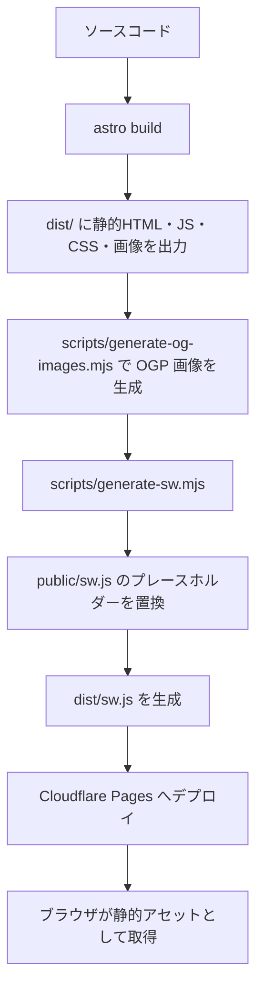

# システムアーキテクチャ設計書

本ドキュメントは、**CODE:LIFE Tools**（[tools.codelife.cafe](https://tools.codelife.cafe)）のシステム全体像、技術スタック、およびアーキテクチャ設計について記述します。

---

## 1. 設計思想とコア原則

### 1.1 完全クライアントサイド処理 (Zero Server-side Logic)
本プロジェクトの最優先事項は**「ユーザーデータのプライバシーと安全性」**です。
- すべてのデータ処理（テキスト変換、CSV/JSON整形、画像処理、PDF編集、AI背景削除など）は、利用者のWebブラウザ内で完結します。
- 外部のサーバーに対して処理対象データ（入力されたテキスト、アップロードされた画像やPDF等）を送信するAPIコールや通信は一切行いません。
- これにより、機密性の高い業務データや個人情報であっても、情報漏洩のリスクなしで安心して利用できる設計となっています。

### 1.2 オフラインファースト (PWA)
Service Worker を用いることで、一度アクセスしてインストール（PWA）した後は、インターネット接続がない環境（オフライン）でもすべてのツールを利用可能です。

---

## 2. 技術スタック

本プロジェクトは以下のモダンな技術スタックを採用しています。

- **静的サイトジェネレーター (SSG):** [Astro](https://astro.build/)
  - 静的HTMLをベースとした高速なページ読み込みと、必要な部分だけReactコンポーネントをハイドレートする「Astro Islands」を採用しています。
- **UIライブラリ:** [React](https://react.dev/) + [shadcn/ui](https://ui.shadcn.com/)
  - UIコンポーネントの構築と状態管理（React Islands）に利用しています。
- **スタイリング:** [Tailwind CSS v4](https://tailwindcss.com/)
  - 新しい CSS-first 設定を採用し、高速で一貫性のあるデザインを構築しています。
- **アイコン:** [Lucide Icons](https://lucide.dev/)
  - ベクターアイコンの表示に利用しています。
- **静的解析 / フォーマッタ:** [Biome](https://biomejs.dev/)
  - 高速なLinter/Formatterとして採用し、コード品質と一貫性を担保しています。
- **E2Eテスト:** [Playwright](https://playwright.dev/)
  - ブラウザ自動操作による全ツールの機能検証を行っています。
- **ホスティング:** Cloudflare Pages
- **CI/CD:** GitHub Actions

---

## 3. ディレクトリ構成

プロジェクトのディレクトリ構造は以下の通りです。

```
src/
├── components/          # UIコンポーネント
│   ├── ui/              # shadcn/ui コンポーネント（Biome自動生成、手動編集不可）
│   ├── layout/          # 共通レイアウト部品（Header, Footer, Navigation, SafetyBadge等）
│   ├── tools/           # 汎用的な各ツール固有React UI（テキスト/データ/開発系など）
│   ├── image-* / pdf-*  # 画像・PDF系など機能単位のReact UIコンポーネント群
│   ├── zipcode/         # 郵便番号変換ツールのUIとチャンク取得補助
│   └── common/          # 汎用部品（CopyButton, FileDropzone, ToolLayout, ToolCard等）
├── layouts/
│   └── BaseLayout.astro # 全ページ共通HTMLレイアウト（SEO, View Transitions, SW登録）
├── pages/
│   ├── index.astro      # トップページ（Bento Gridによるツール一覧）
│   ├── [tool-name].astro# 各ツールの個別ページ（Astroシェル）
│   ├── offline.astro    # オフライン時のフォールバックページ
│   ├── privacy.astro    # プライバシーポリシー
│   └── about.astro      # このサイトについて
├── lib/
│   ├── tools/           # 各ツールのビジネスロジック、ツールカタログ、関連ツール選定
│   ├── encoding/        # 文字コード判定・改行/エンコード変換
│   ├── validation/      # ファイル検証などの共通検証ロジック
│   └── utils.ts         # 共通ユーティリティ（cn関数など）
├── styles/
│   └── global.css       # Tailwind CSS v4 設定、カラーテーマ、アニメーション定義
└── workers/
    └── bg-remove.worker.ts # 重量の重い処理（AI背景削除など）のためのWeb Worker
```

---

## 4. PWA & Service Worker 構成

オフライン動作を可能にし、かつ高速なキャッシュ制御を行うため、独自のビルド＆デプロイプロセスを構築しています。

### 4.1 キャッシュのライフサイクルとビルドフロー
Service Worker（`sw.js`）はビルド時に自動生成されます。

1. **開発フェーズ (`public/sw.js`):**
   - プレースホルダー（`__HASH__`, `/* __ALL_PAGES__ */`, `/* __ALL_ASSETS__ */`）を含んだ Service Worker テンプレートとして管理されます。
2. **ビルドフェーズ (`npm run build`):**
   - `astro build` 実行後、ポストビルドスクリプト `scripts/generate-sw.mjs` が自動起動します。
   - `dist/` ディレクトリを走査し、全ページ（`/` およびツール個別ページ）と、`dist/_astro/` 配下の全静的アセット（JS, CSS, 画像など）のURL一覧を収集します。
   - 収集したコンテンツのハッシュ値を計算して `CACHE_NAME`（`cl-tools-[hash]`）を作成します。
   - プレースホルダーを置換し、最終的な `dist/sw.js` を生成します。

### 4.2 キャッシュ更新ポリシー
- 配信されたアセットファイルにはビルド時に一意のハッシュが含まれており、新しいデプロイが行われると、`generate-sw.mjs` が計算する `CACHE_NAME` のハッシュも変化します。
- Service Worker の `activate` イベント時に、古いハッシュのキャッシュはすべて自動削除され、古いキャッシュの滞留を防止します。
- ナビゲーション時および静的アセット要求時は、基本的に **Cache First** で高速に応答し、最新のコンテンツはバックグラウンド、もしくは新しい Service Worker の有効化時にプリキャッシュされます。

---

## 5. ビルド・デプロイフロー

本プロジェクトは、ソースコードから静的成果物を生成し、Cloudflare Pages で配信する構成です。アプリケーション実行時のサーバーサイド処理はなく、ビルド済みファイルだけを公開します。



- `npm run build` は `astro build` を起点に、`dist/` へ静的HTML、Astro が生成した `/_astro/` 配下の JS/CSS/画像、各ページの成果物を出力します。
- 続いて `scripts/generate-og-images.mjs` が `src/lib/tools/catalog.ts` のツール情報をもとに OGP 画像を生成します。
- 最後に `scripts/generate-sw.mjs` が `dist/` を走査し、ページURLと `dist/_astro/` 配下の静的アセットURLを収集します。
- `scripts/generate-sw.mjs` は `public/sw.js` をテンプレートとして読み込み、`__HASH__`、`/* __ALL_PAGES__ */`、`/* __ALL_ASSETS__ */` をビルド結果に合わせて置換します。
- 置換後の Service Worker は `dist/sw.js` として出力され、Cloudflare Pages では他の静的ファイルと同じく配信対象になります。
- ブラウザ側では `src/layouts/BaseLayout.astro` から Service Worker 登録が行われ、`dist/sw.js` が静的アセット・ページのキャッシュ制御を担当します。

---

## 6. データフローと通信境界

ユーザーが入力・アップロードしたテキスト、CSV/JSON、画像、PDF 等の処理対象データは、React Island、Web Worker、`src/lib/tools/` の純粋関数など、ブラウザ内の実行環境だけで処理します。これらのユーザーデータを外部サーバーへ送信する API 通信は設計上許可しません。

一方で、アプリ本体の表示・オフライン動作・一部ツールの実行に必要な静的ファイル取得は発生します。通信の種類、目的、許可範囲は以下の通りです。

| 通信の種類 | 主なファイル・経路 | 目的 | 許可範囲 |
| --- | --- | --- | --- |
| ページ・UIアセット取得 | Cloudflare Pages から配信される HTML、`/_astro/` 配下の JS/CSS/画像、`dist/sw.js` | アプリ本体の表示、Astro Islands のハイドレーション、PWA のキャッシュ制御 | 許可。静的アセット配信のみ。ユーザー入力データは含めない |
| ツールカタログ参照 | `src/lib/tools/catalog.ts` | トップページ、検索、カテゴリ、関連ツール、OGP 画像生成の単一情報源 | 許可。ビルド成果物またはブラウザ内コードとして参照するだけで、外部送信はしない |
| ツール共通レイアウト表示 | `src/components/common/ToolLayout.astro` | `SafetyBadge`、パンくず、関連ツール、構造化データ、ツール本文スロットの表示 | 許可。表示制御のみ。処理対象データの送信はしない |
| Service Worker テンプレート・生成物 | `public/sw.js`、`scripts/generate-sw.mjs`、`dist/sw.js` | プリキャッシュ対象の注入、Cache First / Network First、オフラインフォールバック | 許可。同一オリジンの静的ファイル取得・キャッシュに限定 |
| 郵便番号チャンク取得 | `/data/zipcode/*.json` などの静的JSON | 郵便番号検索・変換に必要な辞書データを必要分だけ取得 | 例外的に許可。静的データのダウンロードのみで、検索語や入力内容は送信しない |
| AIモデルファイル取得 | Cloudflare R2 等で配信されるモデル・WASM・関連ファイル | AI背景削除などのブラウザ内推論に必要なモデルを取得 | 例外的に許可。モデルファイル取得のみで、画像などの処理対象データは送信しない |
| ユーザー入力データ送信 | 入力テキスト、アップロード画像、PDF、CSV/JSON 等 | なし | 禁止。外部API、トラッキング、解析目的の送信を行わない |

この章では通信の境界を整理し、既存の「安全性・セキュリティ設計」ではユーザーに対する安全性の可視化や検証観点を扱います。

## 7. 安全性・セキュリティ設計

### 7.1 安全性の可視化 (`SafetyBadge`)
完全クライアントサイド処理をユーザーに明示し、安心してデータを入出力してもらうために、すべてのツールの上部には「完全ローカル処理（外部送信なし）」を示す `SafetyBadge` が自動配置されます。

### 7.2 ツールカタログと関連ツール回遊
ツール一覧・検索・個別ページの関連ツールカードは `src/lib/tools/catalog.ts` を単一の情報源として管理します。`ToolLayout.astro` は現在ページの `path` からツールを解決し、`getRelatedTools()` によって `related` 指定を優先しつつ同カテゴリのツールで最大3件まで補完して表示します。これにより、各ページに手書きの関連リンクを分散させず、回遊導線を一元管理します。

### 7.3 ネットワーク遮断の保証
本アプリは意図的にバックエンドAPIを持たず、静的ファイル配信のみで構成されているため、ブラウザの開発者ツールの「ネットワーク」タブ等で検証しても、ユーザーデータの外部送信が発生しないことが確認できます。

### 7.4 CSP (Content Security Policy) 対策
AIモデル推論などの重量処理を Web Worker 内で実行する際、動的なモジュールインポート（スレッド動的インポートなど）によるCSPエラーを完全に防止するため、Web Worker 内の並列スレッド数制限（`numThreads = 1`）やプロキシ停止（`proxy = false`）を明示的に設定しています。
